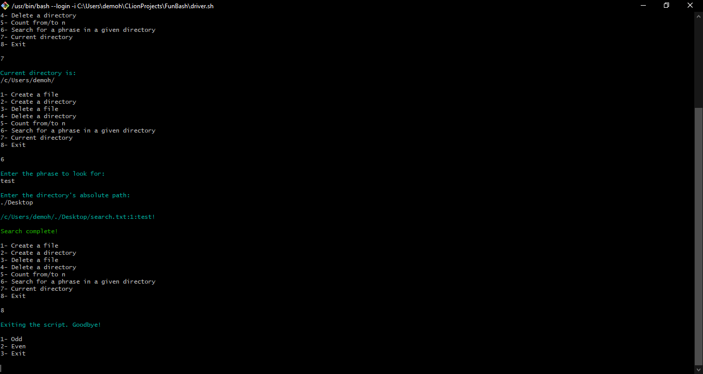
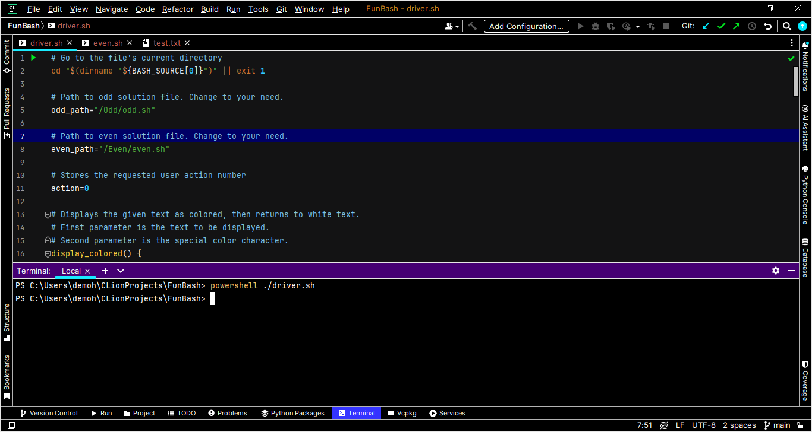
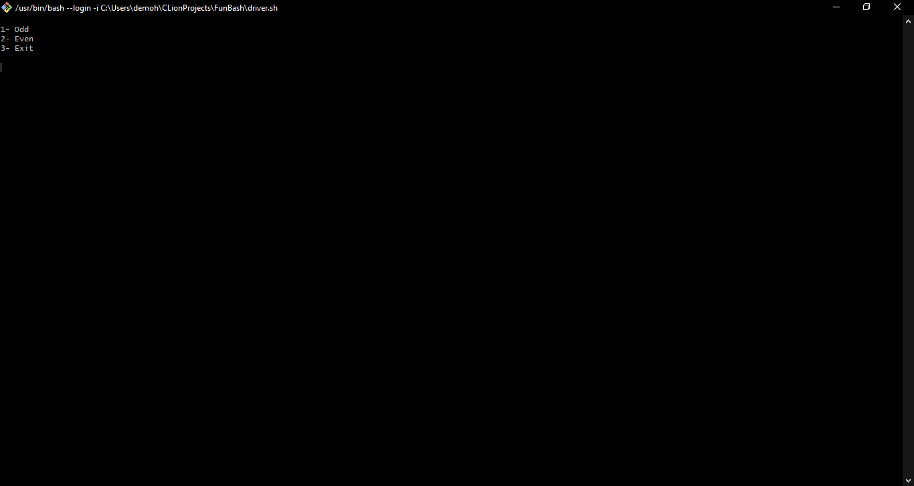
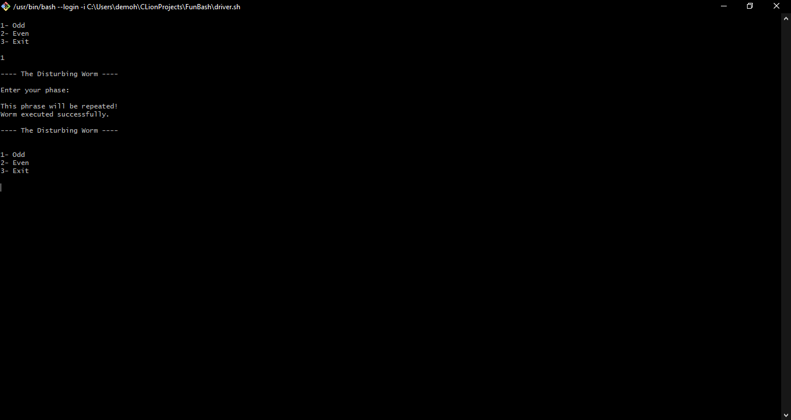
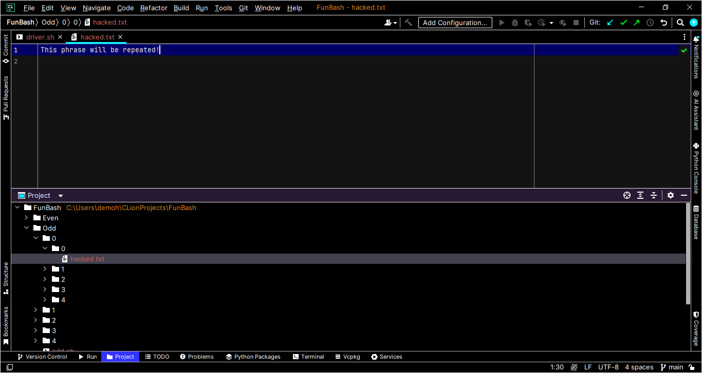
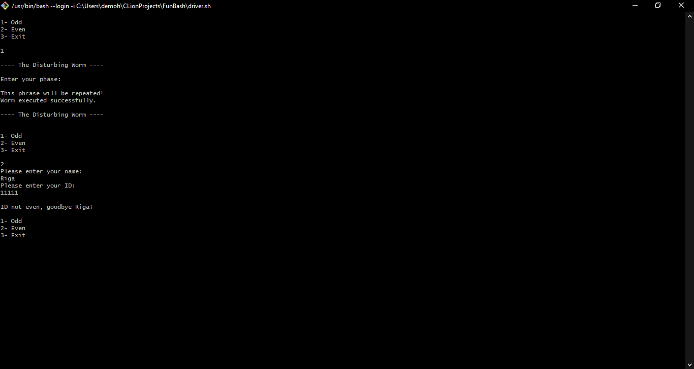
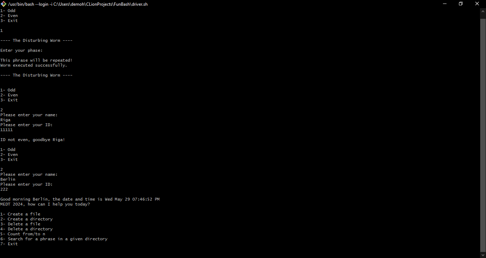
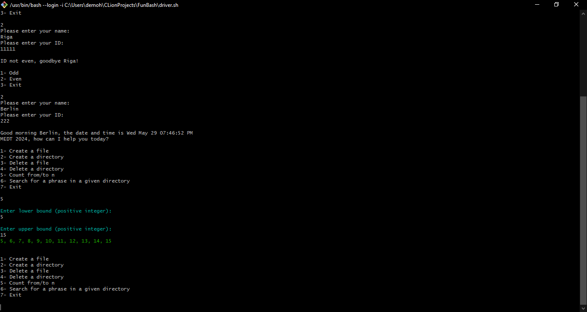
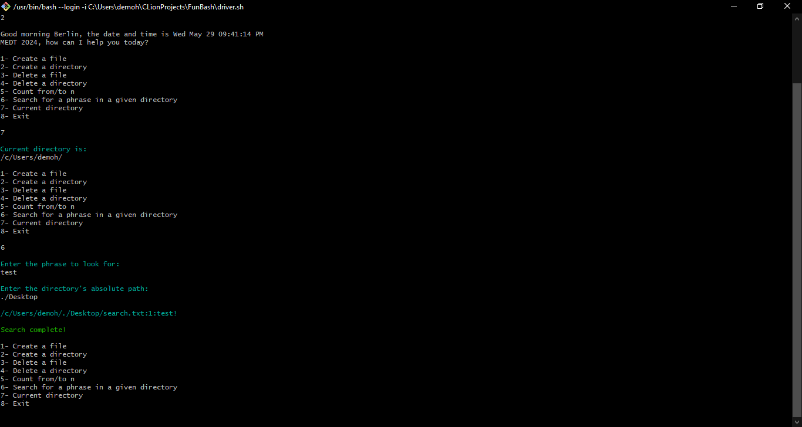

# FunBash 🐢

A little fun project used for learning Bash.

## Features

The project has three files:

1. [`driver.sh`](./driver.sh): Responsible for running the other two files.
2. [`odd.sh`](./Odd/odd.sh): A program demonstrating a simple computer worm software.
3. [`even.sh`](./Even/even.sh): A program providing some functionalities.

## Usage

- Change into the cloned directory.
- On a Linux/Unix system, simply run `driver.sh` file using: `./driver.sh`. 
- On Windows, the following command must be used in the CMD `powershell ./driver.sh`.
- In both cases, the driver file must be given execution privilages.

## Screenshots

## Here an option for displaying the current path was added for convenience: 

## License

[MIT License](https://choosealicense.com/licenses/mit/)

Copyright (c) 2024

Permission is hereby granted, free of charge, to any person obtaining a copy
of this software and associated documentation files (the "Software"), to deal
in the Software without restriction, including without limitation the rights
to use, copy, modify, merge, publish, distribute, sublicense, and/or sell
copies of the Software, and to permit persons to whom the Software is
furnished to do so, subject to the following conditions:

The above copyright notice and this permission notice shall be included in all
copies or substantial portions of the Software.

THE SOFTWARE IS PROVIDED "AS IS", WITHOUT WARRANTY OF ANY KIND, EXPRESS OR
IMPLIED, INCLUDING BUT NOT LIMITED TO THE WARRANTIES OF MERCHANTABILITY,
FITNESS FOR A PARTICULAR PURPOSE AND NONINFRINGEMENT. IN NO EVENT SHALL THE
AUTHORS OR COPYRIGHT HOLDERS BE LIABLE FOR ANY CLAIM, DAMAGES OR OTHER
LIABILITY, WHETHER IN AN ACTION OF CONTRACT, TORT OR OTHERWISE, ARISING FROM,
OUT OF OR IN CONNECTION WITH THE SOFTWARE OR THE USE OR OTHER DEALINGS IN THE
SOFTWARE.
